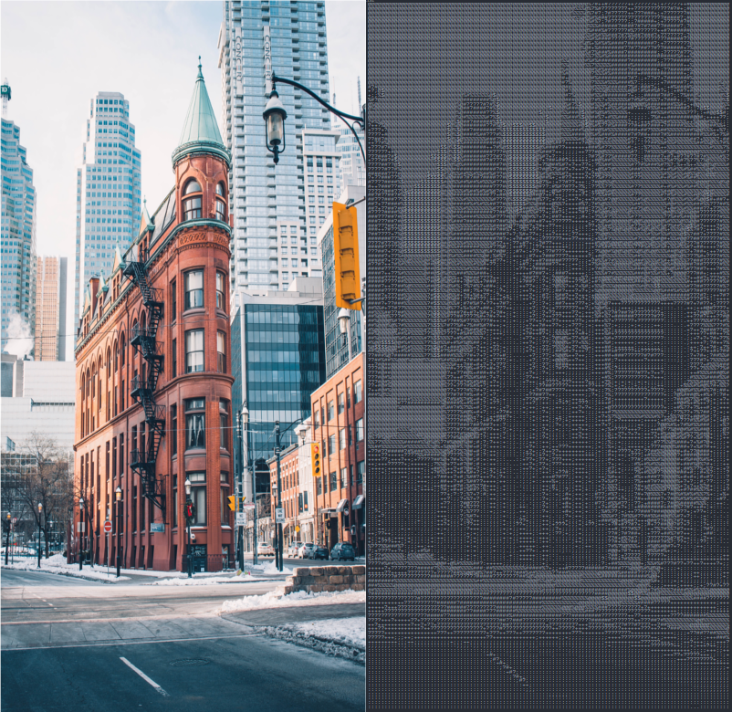
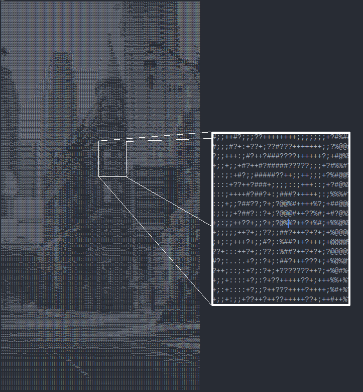

# Image to ASCII converter

*Work still in progress*

Generate ASCII art from an image.

## Demo

[Original image](https://unsplash.com/photos/W_MUqtuHwyY) by _Dawson Lovell_ taken from [Unsplash](https://unsplash.com)



part of the image blown up



## Implementation

The image is first converted to its intensity values in a greyscale version. Then ASCII characters corresponding to the intensity are added to the text file. The characters used here are `' .:;+?#%@$'` sorted by increasing brightness. [This article](http://paulbourke.net/dataformats/asciiart/) by *Paul Bourke* is a very good resource for further reference.

## Dependancies

Pillow for importing and writing out images and Numpy for manipulating image data

```
pip install numpy
  
pip install pillow
```

## Usage

Download or clone the repo. Run
```
python generator.py <path to image> <dimension_arguments>
```
Possible arguments are
```
Default
-o :original size of image

Others
-h <height value> :maintain aspect ratio with specified height
-w <width value> :maintain aspect ration with specified width
-c <width> <height> :custom specify height and width
```
Examples
```
##Creates ascii art from image.jpg with original size of image (number of characters = number of pixels)
python generator.py image.jpg -o

##Creates ascii art 100 characters wide while maintaining aspect ratio of image.jpg
python generator.py image.jpg -w 100

##Creates ascii art 100 characters tall while maintaining aspect ratio of image.jpg
python generator.py image.jpg -h 100

##Creates ascii art 100 characters wide and 100 characters tall
python generator.py image.jpg -c 100 100
```
  
